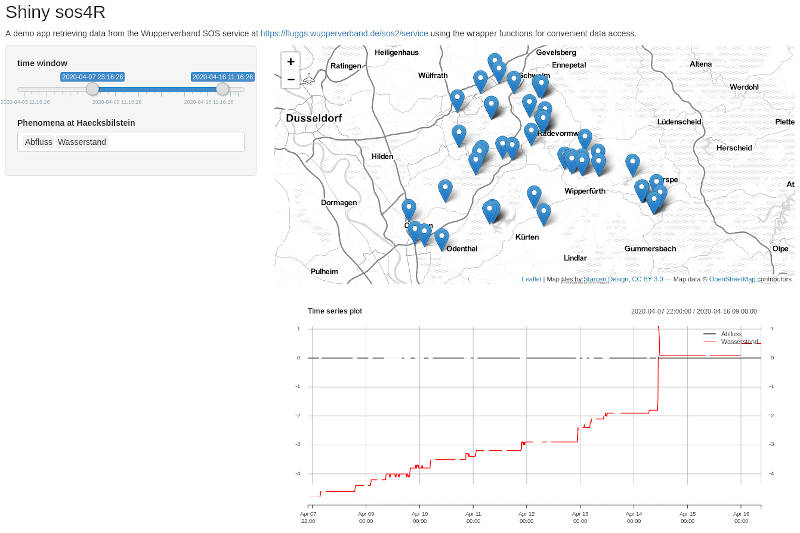

```{r, include = FALSE}
knitr::opts_chunk$set(
  collapse = TRUE,
  comment = "##"
)
```

```{r blog_post, include = FALSE, eval=FALSE}
# run this code chunk to render an HTML snippet for use in Wordpress and copy it to the clipboard
library("knitr")
library("xfun")
# based on knit2::knit2wp
knit2html = function(input, envir = parent.frame(), shortcode = TRUE) {
    out = knitr::knit(input, envir = envir)
    on.exit(unlink(out))
    content = xfun::file_string(out)
    content = markdown::markdownToHTML(text = content, fragment.only = TRUE)
    shortcode = rep(shortcode, length.out = 2L)
    if (shortcode[1])
        content = gsub("<pre><code class=\"([[:alpha:]]+)\">(.+?)</code></pre>", 
            "[sourcecode language=\"\\1\"]\\2[/sourcecode]", 
            content)
    content = gsub("<pre><code( class=\"no-highlight\"|)>(.+?)</code></pre>", 
        if (shortcode[2])
            "[sourcecode]\\2[/sourcecode]"
        else "<pre>\\2</pre>", content)
    content = enc2utf8(content)
    return(content)
}

post = knit2html("sos4R-vignette-10-egu-2020.Rmd")

library("clipr") # requires xclip on Linux
clipr::write_clip(post)
# NOTE: need to handle images manually!
```

# Preface

With EGU 2020 cancelled, this blog post elaborates on the abstract submitted by the 52°North software project `sos4R` development team.
See the program entry for the abstract [EGU2020-19453 in the official programme](https://meetingorganizer.copernicus.org/EGU2020/EGU2020-19453.html).
Please refer to this work by citing the DOI [`https://doi.org/10.5194/egusphere-egu2020-19453`](https://doi.org/10.5194/egusphere-egu2020-19453).

# Introduction

Time series data of in-situ measurements are the key to many environmental studies.
The first challenge in any analysis typically arises when the data needs to be imported into the analysis framework.
Standardization is one way to lighten this burden.
Unfortunately, relevant interoperability standards might be challenging for non-IT experts as long as they are not dealt with behind the scenes of a client application.
One standard to provide access to environmental time series data is the Sensor Observation Service ([SOS](https://en.wikipedia.org/wiki/Sensor_Observation_Service)) specification published by the Open Geospatial Consortium ([OGC](https://www.ogc.org/)).
SOS instances are currently used in a broad range of applications such as hydrology, air quality monitoring, and ocean sciences.
Data sets provided via an SOS interface can be found around the globe from Europe to New Zealand.
  
The R package [sos4R](https://52north.github.io/sos4R/) (Nüst et al., 2011) is an extension package for the R environment for statistical computing and visualization (https://www.r-project.org/), which has been demonstrated as a powerful tool for conducting and communicating geospatial research (cf. Pebesma et al., 2012).
The features presented in this article are available in the new release version `0.4` [on CRAN](https://cran.r-project.org/package=sos4R).

# Access sensor data with sos4R

sos4R comprises a client that can connect to an SOS server.
The user can use it to query data from SOS instances using simple R function calls.
The following example demonstrates some core operations: connect to an SOS, request data availability information and sensor metadata, and retrieve the actual data:

```{r classic_sos}
library("sos4R")
fluggs = SOS(
  url = "https://fluggs.wupperverband.de/sos2/service",
  binding = "KVP",
  version = "2.0.0")
```

```{r classic_sos_sensor}
sensor2 = describeSensor(
  sos = fluggs,
  procedure = sosProcedures(fluggs)[2],
  outputFormat = "http://www.opengis.net/sensorML/1.0.1")
sensor2
```

```{r classic_sos_data_availability}
fluggs_data_availability = getDataAvailability(fluggs)
fluggs_data_availability[1:2]
```

```{r classic_sos_data}
fluggs_offerings = sosOfferings(fluggs)
fluggs_obs_jan_2019 = getObservation(fluggs, offering = fluggs_offerings[[1]],
               eventTime = sosCreateTime(fluggs, "2019-01-01::2019-01-31"),
               responseFormat = "http://www.opengis.net/om/2.0")
result = sosResult(fluggs_obs_jan_2019)

library("skimr")
skimr::skim(result)
```

However, these functions use terms and operations specific to the OGC services and the SOS standard.
They also require some knowledge about working combinations for requests.
Therefore, a new sos4R release provides a convenience layer for R users to integrate observation data from data access servers compliant with the SOS standard without any knowledge about the underlying technical standards.
This update also features specific consideration of the [OGC SOS 2.0 Hydrology Profile](https://docs.opengeospatial.org/bp/14-004r1/14-004r1.html) and thereby opens up a new scientific domain.

Especially for non-SOS experts, the wrapper functions remove complexity and technical language specific to OGC specifications, e.g., "FOI", or "procedure".
They use more generic terms. These are easily accessible for all users, especially for those without a strong knowledge of the OGC Sensor Web Enablement standards (see ["OGC SWE and SOS"](https://52north.github.io/sos4R/articles/sos4R-vignette-02-ogc-sos.html) vignette for details).
In general, these functions always return an object of class `data.frame`, even if the result is only a list. In this case the `data.frame` has one column.

The following code chunks demonstrate a request for the same data as above, but use the new wrapper functions.

```{r modern_sos_sites}
fluggs_sites = sites(sos = fluggs, includePhenomena = TRUE)

library("kableExtra")
kable(head(fluggs_sites))
```

```{r modern_sos_phenomena}
phenomena = phenomena(
  sos = fluggs,
  includeTemporalBBox = TRUE,
  includeSiteId = TRUE)
watertemp_phenomena = subset(phenomena,
                             phenomenon == "Wassertemperatur")

# function takes R date/time objects as input
timeBegin = as.POSIXct("2018-01-01")
timeEnd = as.POSIXct("2018-03-01")

observationData = getData(
  sos = fluggs,
  sites = subset(fluggs_sites, Wassertemperatur == TRUE),
  phenomena = watertemp_phenomena,
  begin = timeBegin,
  end = timeEnd)

skimr::skim(observationData)
```

The result `data.frame` includes additional metadata.

```{r getData_attributes}
attributes(observationData[[3]])
```

As shown in the code, you can filter the results with objects created with other functions.
The data returned can be limited by thematical, spatial, and temporal filters.
Thematical filtering (phenomena) supports the values of the previous functions as inputs.
Spatial filters are either sites, or a bounding box.
A temporal filter is a time period during which observations are made.
Without a temporal extent, the SOS only returns the last measurement.

Furthermore, the user can use spatial information about the sites and temporal information about the available phenomena and display sites on a map without having to touch coordinates or map projections.
For example, the `fluggs_sites` object is a `SpatialPointsDataFrame` with a proper coordinate reference system (CRS).

```{r modern_sos_bbox}
fluggs_sites@proj4string
sp::bbox(fluggs_sites)
```

```{r sites_map, fig.width=6, fig.align='center', fig.cap = paste0("Map of", "x")}
suppressPackageStartupMessages(library("mapview"))
sites_map = mapview(fluggs_sites)
map_file = tempfile(fileext = ".png") #here::here("map.png")
# requires phantomjs, webshot::install_phantomjs()
mapshot(sites_map, file = map_file)
knitr::include_graphics(map_file)
```

# Integrated data analysis

The abstraction provided by sos4R makes sensor observation data easily accessible across multiple SOS instances.
It seamlessly integrates distributed observations data, i.e., across organizational boundaries, into transparent and reproducible data analysis workflows.
These workflows can leverage the vast number of R packages for data science with geospatial and time series data.

Let's plot the received data as time series:

```{r getData_timeseries_plot, fig.width=6}
suppressPackageStartupMessages(library("xts"))
siteName = "Schevelinger-Talsperre_Absperrbauwerk"
dataColumn = 3
tsFluggs = xts(
  observationData[observationData$siteID == siteName, dataColumn],
  observationData[observationData$siteID == siteName, "timestamp"])
names(tsFluggs) = siteName
unitOfMeasurement = sosUOM(
  attributes(observationData[[dataColumn]])$defaultPointMetadata)
plot(x = tsFluggs,
     main = paste0("Water temperature (", unitOfMeasurement, ")"),
     sub = attributes(observationData[[dataColumn]])$defaultPointMetadata@interpolationType@href,
     yaxis.right = FALSE, legend.loc = "topleft")
```

It is now straightforward to combine and visualize data from two different SOS servers.
In this example, we'll just combine water temperature from Germany and New Zealand.

```{r niwa_data}
niwa = SOS(
  url = "https://hydro-sos.niwa.co.nz/",
  binding = "KVP",
  useDCPs = FALSE,
  version = "2.0.0")
siteList = siteList(sos = niwa)
phenomenaNiwa = phenomena(sos = niwa)

observationDataNiwa = getData(sos = niwa,
  phenomena = phenomenaNiwa[25, 1],
  sites = siteList$siteID[40],
  begin = timeBegin,
  end = timeEnd)
attributes(observationDataNiwa[[3]])
skimr::skim(observationDataNiwa)
```

```{r multiple_timeseries_plot, fig.width=6}
ts1056 = xts(observationDataNiwa[observationDataNiwa$siteID == 'AK1', 3], observationDataNiwa[observationDataNiwa$siteID == 'AK1',"timestamp"])
names(ts1056) = "Station#AK1 @ NIWA"
plot(
  x = na.fill(merge(tsFluggs, ts1056), list(NA, "extend", NA)),
  main = "Incomparable temperatures",
  yaxis.right = FALSE,
  legend.loc = 'topleft')
```

# Shiny application

We also illustrate the use of the sos4R package in a simple, yet easily extensible [Shiny](https://shiny.rstudio.com/) web application.
By default, the application queries a SOS service operated by the Wupperverband (see `fluggs` SOS above).
This SOS provides various hydrological time series.
Upon start-up, the app portrays all measurement stations reporting data in a given time window on a map (see screenshot below).
The user can interactively change this time window in the sidebar on the left hand side of the user interface.
After the user selects a single station on the map, a list with the phenomena available appears in the sidebar and the app downloads the data for the given period.
The data retrieved is converted into an [`xts` object](https://cran.r-project.org/package=xts) and shown as a plot beneath the map window.
The user can select one or more phenomena and the app will automatically update the plot with the newly retrieved data.

You can try out the app online at  **[http://pilot.52north.org/shinyApps/sos4R/](http://pilot.52north.org/shinyApps/sos4R/)**.
The app's source code, merely three function calls of sos4R wrapped in a simple graphical user interface, is [part of the sos4R package](https://github.com/52North/sos4R/tree/master/inst/shiny).



# References

Nüst D., Stasch C., Pebesma E. (2011) Connecting R to the Sensor Web. In: Geertman S., Reinhardt W., Toppen F. (eds) Advancing Geoinformation Science for a Changing World. Lecture Notes in Geoinformation and Cartography, Springer. doi:[10.1007/978-3-642-19789-5_12](https://doi.org/10.1007/978-3-642-19789-5_12)

Pebesma, E., Nüst, D., & Bivand, R. (2012). The R software environment in reproducible geoscientific research. Eos, Transactions American Geophysical Union, 93(16), 163–163. doi:[10.1029/2012EO160003](https://doi.org/10.1029/2012EO160003)
